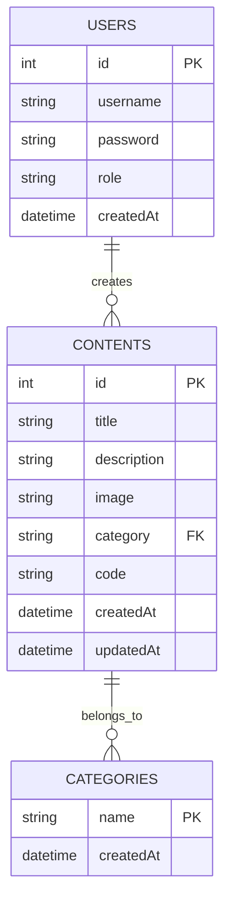

# 🎓 Ders Takip Projesi - Kod & Devre Paylaşım Platformu

Bu proje, öğrencilerin programlama örneklerini ve devre projelerini paylaşabilecekleri modern bir web uygulamasıdır.

## ✨ Ana Özellikler

### 🎨 Frontend
- ✅ **Modern React/Next.js** arayüzü (TypeScript)
- ✅ **Responsive tasarım** (Tailwind CSS) 
- ✅ **Gelişmiş proje galerisi** ve modal görüntüleyici
- ✅ **Kategori filtreleme** ve slider navigasyon
- ✅ **Kod kopyalama özelliği** 
- ✅ **Ayrı kod modal'ı** - büyük ve düzenli kod görüntüleme
- ✅ **Delete özelliği** - confirmation modal ile güvenli silme
- ✅ **Scroll destekli açıklamalar** - uzun metinler için
- ✅ **Varsayılan fotoğraf sistemi** - fotoğraf olmadığında otomatik fallback

### 🗄️ Backend  
- ✅ **JSON tabanlı veri depolama** - basit ve etkili
- ✅ **RESTful API endpoints** - modern API tasarımı
- ✅ **CRUD operasyonları** (Create, Read, Update, Delete)
- ✅ **Otomatik timestamp** tracking
- ✅ **Form validation** ve error handling

## 🚀 Kurulum

### 1. Depoyu Klonla
```bash
git clone https://github.com/everyoneexe/student-code-platform.git
cd ders-takip
```

### 2. Bağımlılıkları Yükle
```bash
npm install
```

### 3. Geliştirme Sunucusunu Başlat
```bash
npm run dev
```

### 4. Tarayıcıda Aç
```
http://localhost:3000
```

## 📂 Proje Yapısı

```
ders-takip/
├── app/
│   ├── admin/
│   │   └── dashboard/          # Admin Panel
│   ├── api/
│   │   ├── contents/           # İçerik API'leri
│   │   ├── add-content/        # İçerik ekleme API
│   │   └── categories/         # Kategori API'si
│   └── page.tsx               # Ana sayfa
├── components/
│   └── ContentGallery.tsx     # Ana galeri komponenti
├── lib/
│   └── data-store.ts          # JSON veri yöneticisi
├── data/
│   └── contents.json          # Veri dosyası
├── public/
│   ├── default.jpg            # Varsayılan fotoğraf
│   └── uploads/               # Yüklenen dosyalar
└── package.json
```

## 🗄️ Veritabanı Teknolojisi

### 🔥 **Firebase Firestore + Storage**
Bu proje **Google Firebase** ekosistemi kullanarak **cloud-based NoSQL** veritabanı ile geliştirilmiştir:

```
Firebase Services:
├── 🔥 Firestore Database    # NoSQL document database
├── 📁 Firebase Storage      # File storage (images, files)
├── 🔐 Firebase Auth         # Authentication (optional)
└── 📊 Firebase Analytics    # Usage analytics (optional)
```

### 💾 **Veritabanı Mimarisi:**
- **Database Type:** Cloud Firestore (NoSQL Document Database)
- **Technology:** Google Firebase
- **Data Format:** Document-based JSON storage
- **ACID Properties:** Full ACID compliance
- **Scalability:** Enterprise-level, auto-scaling
- **Real-time:** Live data synchronization

### 🔄 **Firebase Service Katmanı:**
```typescript
// lib/firebase-service.ts - Firebase abstraction layer
class ContentService {
  // Firestore CRUD Operations
  static async getAllContents(): Promise<ContentItem[]>
  static async addContent(content: ContentItem): Promise<string | null>
  static async updateContent(id: string, updates: Partial<ContentItem>): Promise<boolean>
  static async deleteContent(id: string): Promise<boolean>
}

class StorageService {
  // Firebase Storage Operations
  static async uploadImage(file: File, path: string): Promise<string | null>
  static async deleteImage(imageUrl: string): Promise<boolean>
}
```

### 🎯 **Neden Firebase Firestore?**

| **Avantajlar** | **Açıklama** |
|----------------|--------------|
| ☁️ **Cloud-Based** | Sunucu yönetimi gerektirmez |
| 🚀 **Real-time** | Anlık veri senkronizasyonu |
| 📈 **Scalable** | Otomatik ölçeklendirme |
| 🔐 **Secure** | Built-in güvenlik kuralları |
| 🌍 **Global CDN** | Dünya çapında hızlı erişim |
| 💰 **Cost-Effective** | Pay-as-you-use model |

### 📊 **Firestore Collections:**
```typescript
// contents collection
{
  id: string,                    // Auto-generated document ID
  title: string,                 // Proje başlığı
  description: string,           // Proje açıklaması
  image: string,                 // Firebase Storage URL
  category: string,              // Kategori
  code: string,                  // Kod örneği
  createdAt: Timestamp,          // Firebase server timestamp
  updatedAt: Timestamp           // Firebase server timestamp
}

// categories collection
{
  id: string,                    // Auto-generated document ID
  name: string,                  // Kategori adı
  createdAt: Timestamp           // Firebase server timestamp
}
```

### 🔧 **Firebase Configuration:**
```typescript
// lib/firebase.ts
const firebaseConfig = {
  apiKey: "AIza...",
  authDomain: "project.firebaseapp.com",
  projectId: "student-platform",
  storageBucket: "project.appspot.com",
  messagingSenderId: "123456789",
  appId: "1:123:web:abc123"
}
```

## � API Endpoints

### İçerik İşlemleri
```bash
GET    /api/contents           # Tüm içerikleri getir
POST   /api/contents           # Yeni içerik ekle
DELETE /api/contents/[id]      # İçerik sil
```

### Admin İşlemleri
```bash
POST   /api/add-content        # Admin panelinden içerik ekle
GET    /api/categories         # Kategorileri getir
```

## 📊 Veri Yapısı ve ER Diyagramı

### Entity-Relationship Diyagramı



### ContentItem Entity
```typescript
interface ContentItem {
  id: number                    // Primary Key - Unique ID
  title: string                 // Proje başlığı
  description: string           // Proje açıklaması
  image: string                 // Fotoğraf URL'i (Foreign Key to Files)
  category: string              // Foreign Key to Categories
  code: string                  // Kod örneği
  createdAt: string            // Timestamp - Oluşturulma tarihi
  updatedAt: string            // Timestamp - Güncellenme tarihi
}
```

### Category Entity
```typescript
interface Category {
  name: string                  // Primary Key - Kategori adı
  createdAt: string            // Timestamp - Oluşturulma tarihi
}
```

### User Entity (Admin)
```typescript
interface User {
  id: number                    // Primary Key - Unique ID
  username: string              // Kullanıcı adı
  password: string              // Şifre (hashed)
  role: string                  // Rol (admin, user)
  createdAt: string            // Timestamp - Oluşturulma tarihi
}
```

### Relationships
- **Contents ↔ Categories**: Bir içerik bir kategoriye ait (Many-to-One)
- **Users ↔ Contents**: Bir kullanıcı birden fazla içerik oluşturabilir (One-to-Many)
- **Contents ↔ Files**: Bir içeriğin bir fotoğrafı olabilir (One-to-One)

## 🎯 Yeni Özellikler

### 1. **Ayrı Kod Modal'ı**
- Kod örnekleri artık ayrı modal'da açılıyor
- Daha büyük görüntüleme alanı
- "📋 Kod Örneği Gör" butonu ile erişim
- "📄 Kopyala" butonu ile kod kopyalama

### 2. **Delete Özelliği**
- Hover ile görünen delete butonları (kırmızı ×)
- Confirmation modal ile güvenli silme
- "İçeriği Sil" onay sistemi

### 3. **Varsayılan Fotoğraf Sistemi**
- Fotoğraf yüklenmediğinde otomatik `/default.jpg` kullanımı
- API seviyesinde fallback logic
- Responsive görüntüleme

### 4. **Scroll Destekli Açıklamalar**
- Modal'da uzun açıklamalar için scroll özelliği
- `max-h-32` ile sınırlı yükseklik
- Gri kutulu tasarım ile düzenli görünüm

### 5. **Text Overflow Düzeltmeleri**
- `break-words` ile kelime kırma
- `max-width` ile taşma kontrolü
- Responsive text wrapping

## 🎮 Admin Panel

### Erişim
- **URL:** `/admin/dashboard`
- **Şifre:** `oguzhan2025`

### Özellikler
- 📝 **CRUD operasyonları** - Tam içerik yönetimi
- 📊 **İstatistikler** - Toplam içerik ve kategori sayıları
- 🖼️ **Görsel yükleme** - Drag & drop file upload
- 📱 **Responsive tasarım** - Mobil uyumlu
- 🔔 **Form validation** - Kullanıcı dostu hata mesajları

## 🎨 Kullanıcı Arayüzü

### Ana Sayfa Features
- **Kategori Filtreleme:** Tümü, Arduino, Diğer
- **Slider Navigation:** ◀ ▶ butonları ile sayfalama
- **Hover Effects:** Delete butonları ve görsel efektler
- **Modal Interactions:** Tıkla-aç modal sistemi
- **Code Syntax:** Syntax highlighted kod blokları

### Responsive Design
- **Desktop:** 3 sütunlu grid layout
- **Tablet:** 2 sütunlu layout
- **Mobile:** Tek sütun responsive tasarım

## 🛠️ Kullanılan Teknolojiler

- **Frontend:** Next.js 14, React, TypeScript
- **Styling:** Tailwind CSS
- **Icons:** Emoji icons (📋, ✅, 📄, ×)
- **API:** Next.js API Routes
- **Data:** JSON file-based storage
- **File Handling:** Multipart form data

## 🔍 Kullanım Örnekleri

### İçerik Görüntüleme
1. Ana sayfada kategori seç
2. Proje kartına tıkla
3. Modal'da detayları gör
4. "📋 Kod Örneği Gör" ile kodu incele

### İçerik Ekleme
1. `/admin/dashboard` adresine git
2. Şifre gir: `oguzhan2025`
3. Form doldur (başlık, açıklama, kategori, kod)
4. Fotoğraf yükle (opsiyonel)
5. "İçerik Ekle" butonuna tıkla

### İçerik Silme
1. Ana sayfada proje kartının üzerine hover yap
2. Kırmızı "×" butonunu tıkla
3. Confirmation modal'da "Sil" butonuna tıkla

## 🐛 Troubleshooting

### Genel Sorunlar
1. **Port 3000 meşgul** → `lsof -ti:3000 | xargs kill -9`
2. **Node modules sorunu** → `rm -rf node_modules && npm install`
3. **Varsayılan fotoğraf yüklenmiyor** → `public/default.jpg` dosyasını kontrol et

### Development
```bash
# Clean install
rm -rf node_modules package-lock.json
npm install

# Reset data
echo "[]" > data/contents.json

# Check file permissions
ls -la public/default.jpg
```

## 📈 İstatistikler

- **Toplam Component:** 1 ana galeri komponenti
- **API Endpoint:** 4 RESTful endpoint
- **Responsive Breakpoint:** 3 farklı ekran boyutu
- **Modal Type:** 3 farklı modal türü

## 🎉 Sonuç

Bu proje **modern web development** prensiplerine uygun olarak geliştirilmiş:

- 🎯 **User Experience** odaklı tasarım
- 🔧 **Maintainable** kod yapısı  
- 📱 **Mobile-first** responsive tasarım
- 🚀 **Performance** optimized
- 💻 **Developer-friendly** API design

Ödev düzeyinde gelişmiş bir sistem olmasının yanı sıra, gerçek dünya projelerinde kullanılabilir **production-ready** özelliklere sahiptir! 🔥

